  

  
  
  
  

  <b>I build tools that turn data into decisions, and I can sell what I build.</b> 
  ex-Microsoft (LLM evaluation) · SCU MS Business Analytics '25 · Santa Clara, CA

---

### 🛰️ Mission log

- 🔭 **Evaluate:** Benchmarked 4 production LLMs on financial sentiment at Microsoft. Co-authored
  [*Can AI Read Between the Lines? Benchmarking LLMs on Financial Nuance*](https://arxiv.org/abs/2505.16090),
  and our findings ran on the [Microsoft 365 Copilot blog](https://techcommunity.microsoft.com/blog/microsoft365copilotblog/llms-can-read-but-can-they-understand-wall-street-benchmarking-their-financial-i/4412043).
- 🛠️ **Build:** Python tools, data pipelines, and LLM apps that people actually use: a cover letter
  generator with 300+ users, and a churn model (95% accuracy on 20,000 users) that took 1st place.
- 🤝 **Sell:** $500K+ in personal in-person sales at Live Nation. Founded
  [Execute Coaching](https://executecoaching.org).

### 🚀 Featured launches

| | Project | What it does | Stack |
|---|---|---|---|
| 📈 | [**Options Scanner**](https://github.com/dominickkubica/options-scanner) | Ranks credit spreads, condors, and cash-secured puts, then checks its own scores against what actually happened | Python · pandas · DuckDB · FastAPI · React |
| 🔍 | **Website Audit Tool** | Crawls a business's site and turns it into a polished PDF audit (speed, SEO, conversion gaps) I use to open sales conversations | Python · PageSpeed API · Places API |
| ✉️ | [**Cover Letter Generator**](https://github.com/dominickkubica/CoverLetterProject) | Searches live job postings, embeds your resume, and writes a cover letter for the job you pick | LangChain · Pinecone · OpenAI · Streamlit |
| 🎙️ | [**Earnings Call Analyzer**](https://github.com/dominickkubica/msftstreamlit) | Sentiment by business line across Microsoft earnings calls, set against the stock's move, plus a chatbot over the transcripts | Python · OpenAI · Plotly · Streamlit |
| 🎓 | [**SCU Scholarship Finder**](https://github.com/dominickkubica/NLP_Project) | Scrapes scholarships and uses an LLM to match them to a student's profile | Python · OpenAI · Streamlit |
| 🏋️ | [**AI Fitness Coach**](https://github.com/dominickkubica/fitness) | Builds a week of meals and training around your stats and goal | Python · OpenAI · Plotly · Streamlit |

### 🧰 Toolkit

  
  
  
  
  
  
  
  
  
  
  
  
  
  
  

### 📡 Open a channel

Hiring for GTM engineering, forward-deployed engineering, or technical sales? Or just want to talk
LLM evals, options, or lifting? [LinkedIn](https://www.linkedin.com/in/dominick-kubica/) is the
fastest way to reach me, or email **dominickkubica@gmail.com**.

  
   
  <i>Build cool stuff, lift heavy things.</i>

